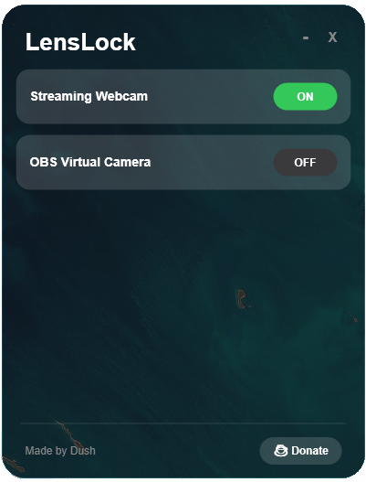

# 🔒 LensLock Portable

**LensLock Portable** is a fast and simple privacy tool that allows you to instantly enable or disable your webcams with just a single click. Protect your privacy effortlessly without navigating through complex settings.

## ✨ Key Features
* 🛡️ **One-Click Toggle:** Instantly turn your cameras ON or OFF with a single button press.
* 📷 **Universal Support:** Works perfectly with both **Real (Hardware) Webcams** and **Virtual Cameras**.
* 🚀 **100% Portable:** No installation required! Just download and run the file directly.
* ⚡ **Lightweight:** Runs smoothly in the background without slowing down your PC.

## 📸 Preview

## 📥 Download & Explore More
You can download the latest version of **LensLock Portable** and explore many more useful, AI-assisted small software tools I have developed. 

🌐 **[Visit My Software Hub (dushhub.github.io)](https://dushhub.github.io/)**

---
### 👨‍💻 Developed By
**Dush** - *Building practical tools for everyday problems.*
